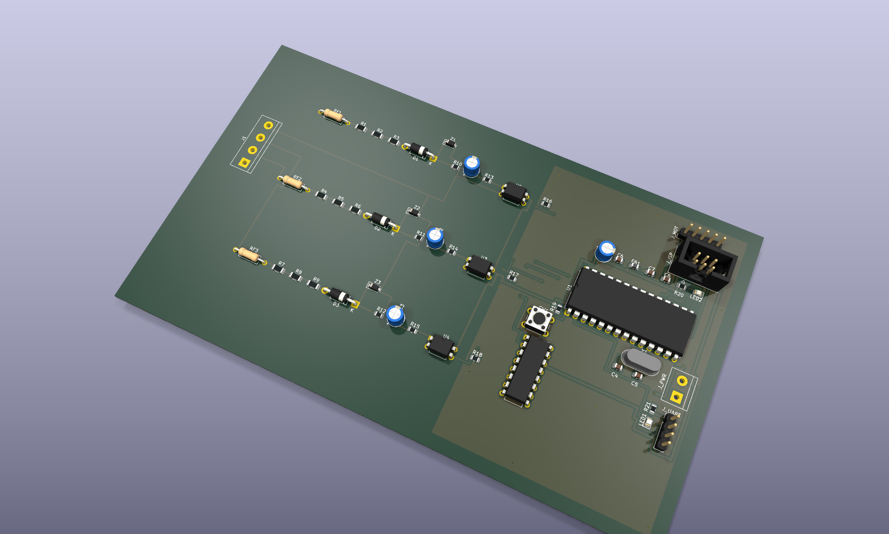
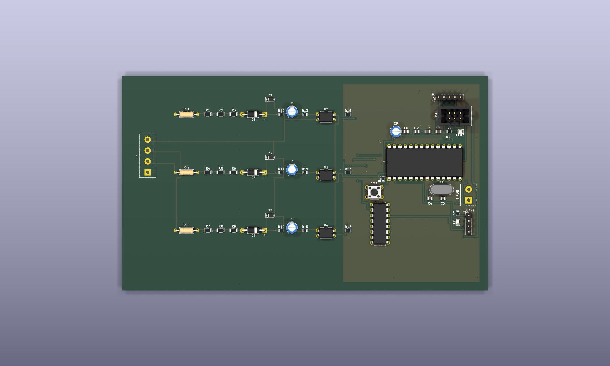
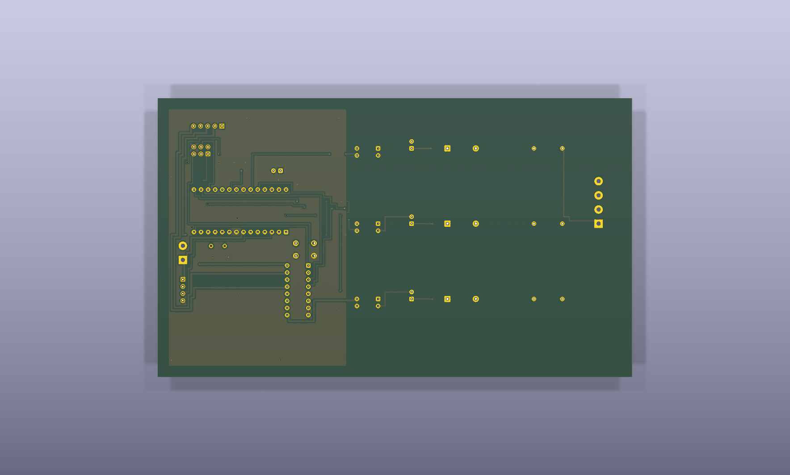

# VoltShift

**Automatic voltage-stable line switcher.**

In many villages and homes the supply arrives unbalanced — some lines sit weak,
some sit high, and people walk over to the board and move the home supply to the
line that behaves. VoltShift does that switching automatically: it watches three
incoming lines, picks the one that is stable near 240 V, and drives a selector
switch onto it with a stepper motor — or to OFF when no line is safe.

## Repository layout

| Path | What it is |
| --- | --- |
| `pcb/` | KiCad 9 project — `voltshift.kicad_pro`, schematic, board and netlist |
| `firmware/` | ATmega328P firmware (bare-metal C, PlatformIO) |
| `media/` | Board renders, layer plots, schematic SVG and PDF |
| `docs/` | Schematic PDF and the ERC report |

## How it works

1. **Sensing** — three identical channels (R, Y, B), each a fusible 4R7 input
   resistor, three 150k 1 % series resistors stepping the AC line down, and a
   1N4007 rectifier turning it into a DC level the MCU can read. A 4k7 shunt,
   a 5.6 V zener and a 47 µF cap clamp and smooth that level.
2. **Isolation** — each channel feeds a PC817 optocoupler, so the mains domain
   stays galvanically separate from the logic domain; the opto output lands on
   an ATmega328P ADC input through a 10k pull-down.
3. **Decision** — the MCU samples all three inputs continuously, accepts only a
   line that reads stable near 240 V, and rejects anything too high or too low.
4. **Switching** — a 28BYJ-48 stepper driven by a ULN2003A turns the selector
   through four 45° positions: the healthy line, or OFF when nothing is in
   range.

The board keeps manual switching out of the equation — the home supply always
lands on the healthiest voltage.

## Hardware

- **MCU** — ATmega328P-PU @ 16 MHz, with ISP (2×3) and 5 V TTL UART headers
- **Drive** — ULN2003A → 28BYJ-48 stepper selector
- **Sensing** — 3× opto-isolated AC channels → ADC0/1/2
- **Power** — external 5 V DC input, ferrite-isolated AVCC
- **Board** — 170 × 100 mm, 2-layer, mains domain and logic domain split with
  ≥ 6 mm creepage between them and a ground pour kept to the logic side only
- **Status** — schematic and routed PCB complete, ERC clean (0 errors,
  0 warnings)

### Safety

This board handles **240 VAC mains**. Sense resistors must be rated for the
working voltage, creepage/clearance must be respected, and the board must not
be touched while powered. It is a prototype — validate it against your local
electrical rules before putting it anywhere near a real installation.

## Media



| Top | Bottom |
| --- | --- |
|  |  |

- [Schematic (SVG)](media/voltshift.svg) · [Schematic (PDF)](media/voltshift-schematic.pdf)
- [Top copper layout](media/voltshift-layout-top.svg) · [Bottom copper layout](media/voltshift-layout-bottom.svg)

## Firmware

The firmware lives in `firmware/` and runs directly on the ATmega328P — no Arduino framework, no communication, fully automatic, about 1.8 KB of flash.

```
firmware/include/config.h   # thresholds, calibration, pin map, timing
firmware/src/adc.c           # averaged ADC reads + counts-to-decivolts calibration
firmware/src/selector.c      # line validity, best-line choice, hysteresis
firmware/src/stepper.c       # half-step driver for the 28BYJ-48 selector
firmware/src/led.c           # status LED patterns
firmware/src/main.c          # 1 ms tick, sample/evaluate loop, watchdog
```

Every 10 ms each channel is averaged and converted to decivolts; every 100 ms a line is accepted only if it sits inside 205.0–255.0 V with under 2.0 V of ripple. The selector moves to the accepted line closest to 240 V, only after that line beats the held one by more than 3 V for four consecutive evaluations, and drops to OFF the moment the held line goes invalid. The status LED reports state: slow blink while starting up, solid on a line, fast blink on OFF or while the motor is moving.

Build and flash with PlatformIO:

```
cd firmware
pio run                     # builds firmware.elf / firmware.hex
pio run -t upload           # default programmer is usbasp (ISP)
```

Calibration is per-channel in `include/config.h` — `VS_CAL_OFFSET_*` and `VS_CAL_SPAN_*_PER_100V` map raw ADC counts to voltage; tune them against a known-good meter before trusting the decisions.

## Working on the design

Open `pcb/voltshift.kicad_pro` in KiCad 9 and edit the schematic and the board
directly. Run the Electrical Rules Checker after any change — the last check
came back clean (0 errors, 0 warnings).

Keep the two domains apart while editing: mains circuitry stays left of the
isolation gap, the ground pour belongs to the logic side only, and the 6 mm
creepage between them must survive any move. The exported schematic PDF and
the ERC report are in `docs/`.

## Status

Schematic and PCB are done and ERC-clean, and the firmware builds for the
ATmega328P. Next up: fab the board and build the first unit.

## License

MIT — see [LICENSE](LICENSE).
